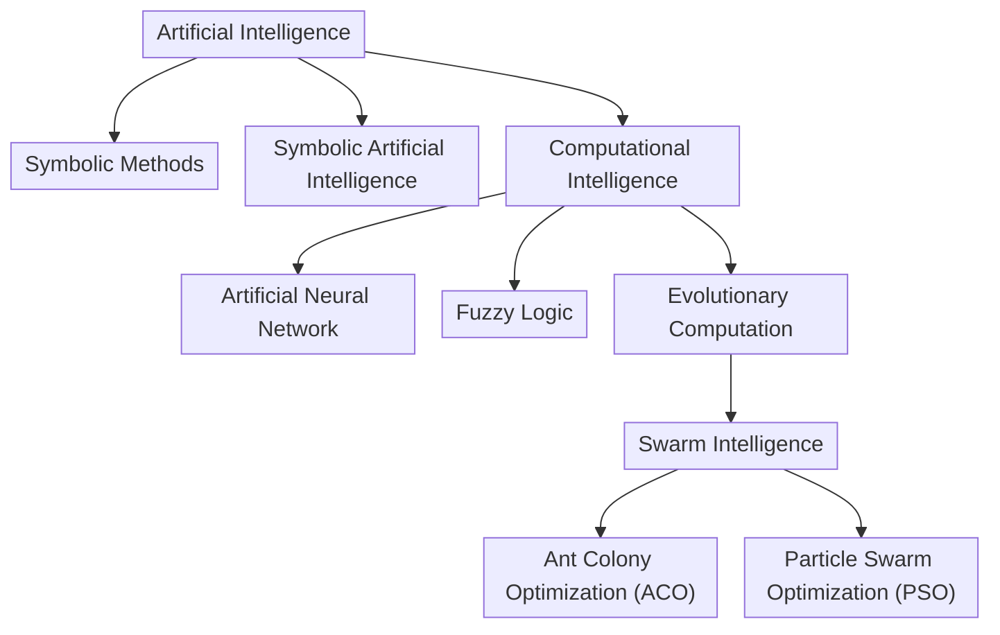

# Swarm Intelligence

## Particle Swarm Optimization (PSO)

1. Initialize population (swarm) randomly
	- They have random velocities to explore the search space
	- Each solution is referred to as a particle
2. Each particle stores
	- Velocity
	- Position
	- Best fitness achieved by the particle (`pbest`)
3. The swarm stores best fintess achieved by any particle in the swarm (`gbest`)
4. Every iteration, for each particle
	1. Update the position of the particle according to its velocity
	2. Calculate fitness at new position
	3. If new fitness is better than `pbest` update it
	4. If new fitness is better than `gbest` update it

## Ant Colony Optimization (ACO)

- Population based algorithm used to approximate solutions to difficult optimization problem
- Used for finding optimal paths in a graph
- It is a probabilistic technique

### Advantages

- Inherent parallelism
- Efficient for several problems
- Positive feedback, which allows for rapid discovery of good solutions
- Can be used in dynamic applications (adapts to changes in the graph)

### Disadvantages

- Theoretical analysis is difficult
- Probabilistic distribution changes by iteration
- Research is experimental, not theoretical
- Time to converge is uncertain